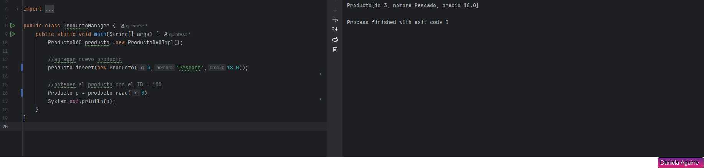
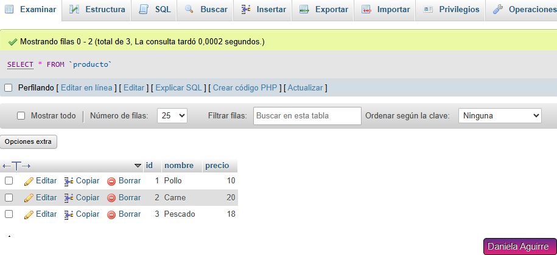

# 📦 Proyecto JDBC - Gestión de Productos

Este proyecto es una aplicación Java básica que implementa CRUD (Crear, Leer, Actualizar y Eliminar) para una tabla de productos en una base de datos MySQL, utilizando JDBC y el patrón DAO (Data Access Object).

## 🖼️ Preview

### 📌 Salida en consola tras insertar y leer un producto



---

### 📌 Vista de la tabla `producto` en phpMyAdmin



## 🛠️ Tecnologías utilizadas

- Java SE (JDK 22)
- JDBC (Java Database Connectivity)
- MySQL (XAMPP)
- NetBeans
- Patrón de diseño DAO


## 🧪 Funcionalidad

- **Insertar** un nuevo producto
- **Leer** un producto por su ID
- **Actualizar** los datos de un producto
- **Eliminar** un producto
- Conexión a base de datos con recuperación automática del ID (`AUTO_INCREMENT`)

## 🧵 Ejemplo de uso

```java
ProductoDAO dao = new ProductoDAOImpl();

// Insertar sin ID (la BBDD lo genera)
Producto nuevo = new Producto(null, "Té verde", 1.5);
dao.insert(nuevo);
System.out.println("Producto insertado con ID: " + nuevo.getId());

// Leer
Producto p = dao.read(nuevo.getId());
System.out.println("Producto leído: " + p);

// Actualizar
p.setPrecio(2.0);
dao.update(p);

// Eliminar
dao.delete(p);


